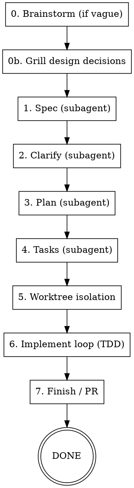

# Feature

Fully automated SDD pipeline for **building a new feature** end-to-end, combining a **planning layer** (specs — WHAT to build) with **Superpowers** (the execution layer — HOW it gets built: worktree isolation, TDD, subagent-per-task, code review, branch finish).

> **Routing:** new feature → `/feature` (this skill) · change an existing feature → `/improve` · bug you hit while testing → `/troubleshoot`.

Flow: load stack profile → brainstorm → grill → spec → clarify → plan → tasks → worktree → implement (TDD, subagents per task, review) → finish/PR. No manual step-by-step required.

## Stack profile (READ FIRST)

This skill is stack-agnostic. Before doing anything, load the project's **stack profile**:

1. Read `.sdd/stack.md` (preferred) or `sdd-stack.md` at the repo root.
2. If neither exists, tell the user: *"No SDD stack profile found. Copy the plugin's `templates/sdd-stack.template.md` to `.sdd/stack.md` and fill it in, or I can proceed with conservative auto-detected defaults."* Then either wait or auto-detect (framework from `package.json`/lockfiles; verify commands from `scripts`).
3. Everywhere this skill says **[PROJECT CONTEXT]**, substitute a compact summary built from the stack profile: stack line, binding context files, conventions, frozen patterns, verify commands. Everywhere it says **[VERIFY]**, substitute the profile's *Verify commands* (run them in order).

The stack profile is the single source of truth for stack specifics — never hardcode a framework, build command, or convention into the run.

## When to Use

- User describes a feature and wants it fully built end-to-end
- User says "build X", "implement X", "create X" with no desire to review intermediate artifacts

**Don't use when:**
- User wants to review and shape the spec before planning (run `/spec` directly)
- Trivial change (see Scaling Guidance below — small work skips the pipeline)

## Scaling Guidance — decide before running

Match the ceremony to the work. Assess from `$ARGUMENTS` (and a quick repo glance if needed):

| Size | Approach |
|------|----------|
| **< 30 min, < 3 files** | Skip the pipeline. Prompt directly, just edit + verify. Tell the user the feature is too small to warrant the full cycle and offer to do it inline. |
| **30 min – 2 hrs, single concern** | Superpowers only: brainstorm (if vague) → TDD → finish. Skip the spec/plan/tasks artifacts. |
| **> 2 hrs, multi-component, or user-shipped** | **Full pipeline** (this skill, all steps). |

If the work is clearly in the bottom two tiers, say so and propose the lighter path rather than running the whole thing. Proceed with the full pipeline only when the work justifies it (or the user insists).

## Process Overview



## Critical Handoff Rules

These keep the planning and execution layers from stepping on each other:

1. **Always generate tasks.md** (step 4) even when tempted to skip it. The implement loop expects small 2–5 minute tasks in exactly that format.
2. **Don't re-plan during execution.** The plan is the contract. When dispatching implementer subagents (step 6), the task list is authoritative — implementers execute, they do not re-plan.
3. **Use ONE execution loop.** This skill uses the Superpowers subagent loop for execution; do not also invoke a separate spec-tooling "implement" command on the same run.
4. **Don't edit code without updating the corresponding spec.** If implementation reveals the spec is wrong, fix `spec.md` first, then the code.
5. **Scope subagent context.** Give each implementer only its task + the relevant spec section — not the entire spec tree.

## Spec layer adaptation

This skill was written against a Spec-Kit-style spec layer (`/speckit-specify`, `/speckit-plan`, `/speckit-tasks`, hooks). Adapt to the profile's **Spec / planning layer**:

- **Spec-Kit present** → use `/speckit-specify`, `/speckit-clarify`, `/speckit-plan`, `/speckit-tasks` and their commit hooks as written below.
- **Plain-markdown specs** → the spec/plan/tasks "subagents" just write the markdown artifacts (spec → plan → task checklist) into the profile's spec location; commit after each.
- **No spec tooling configured ("none")** → **default to plain-markdown specs anyway.** Write a lightweight `spec.md` (overview, user stories, functional requirements, acceptance criteria) into `docs/specs/<NNN>-<slug>/` (or the repo's conventional location), then a short `plan.md` and `tasks.md`. Spec-Kit's clarify/analyze tooling is skipped, but the artifacts are still produced — so every non-trivial run leaves a written spec. Only the lightest scaling tier (< 30 min / < 3 files) may skip artifact generation, and even then the brainstorm/grill output must be captured as a short spec note in the PR description. Worktree + implement + review + finish still apply.

## Step-by-Step Instructions

### 0. Preflight + Brainstorm

Before starting:
1. Load the **stack profile** (see above).
2. Confirm `$ARGUMENTS` is non-empty. If empty, ask: "What feature would you like to build?"
3. Apply **Scaling Guidance**. If too small for the full pipeline, propose the lighter path and stop unless the user wants the full run.
4. If your spec layer tracks an "active feature" pointer, check it — if a feature is already in progress, **stop and ask** whether to continue it or start new. This pause is **mandatory and non-waivable** (a blanket "move fast / I trust you" does NOT waive it): starting a new feature over an active one silently corrupts the other feature's branch/spec state.
5. Verify you are **not** on `main`/`master`. If you are, create a feature branch (your spec tooling's hook may do this automatically — confirm it succeeds).

**Brainstorm gate (conditional):** If the feature description is vague, exploratory, or ambiguous (uncertainty words like "maybe", "some kind of", under-specified scope, multiple plausible interpretations), invoke **`superpowers:brainstorming`** first to clarify requirements and surface alternatives before any spec is written. The brainstormed requirements become the input to step 1.

If the description is already clear and concrete, **skip brainstorming** and pass `$ARGUMENTS` straight to the grill gate.

**Grill gate (recommended):** Before writing the spec, invoke the **`grill-me`** skill to stress-test the design decisions one branch at a time — each question carrying your recommended answer, resolving dependencies between decisions, exploring the codebase to answer questions wherever possible. This pins down the design tree (data model, fields, access control, UI placement, edge cases) while it's still free to change.

Skip the grill gate only when **both**: the feature is in the lightest scaling tier (< 30 min / < 3 files) **and** the design is unambiguous. It is **non-interactive-unsafe** — if running under `/loop` or any autonomous context with no live user, skip the grill and note unresolved decisions as `NEEDS_CLARIFICATION` markers for the spec/clarify steps instead.

---

### 1. Spec — subagent

Dispatch a **spec subagent** (substitute `FEATURE_DESCRIPTION` with `$ARGUMENTS`):

```
You are creating the spec for a new feature.

Feature description: FEATURE_DESCRIPTION

[PROJECT CONTEXT]

Create the spec using the project's spec layer (see profile's "Spec / planning layer"):
1. Create the feature branch (run the spec tooling's branch hook if one exists)
2. Generate spec.md in the correct spec location
3. Validate. Leave genuine ambiguities as NEEDS_CLARIFICATION markers — the next step resolves them. Only auto-resolve markers that have an obvious project-convention default.
4. Commit the spec.

Return:
- FEATURE_DIRECTORY: the path created
- SPEC_FILE: path to spec.md
- BRANCH_NAME: the git branch created
- OPEN_CLARIFICATIONS: count of NEEDS_CLARIFICATION markers
- STATUS: DONE or BLOCKED with reason
```

Wait for result. On BLOCKED: surface the blocker to the user and stop.

---

### 2. Clarify — subagent

Resolve underspecified areas before planning. If the spec subagent reported `OPEN_CLARIFICATIONS: 0` and the feature is straightforward, you may skip — otherwise dispatch a **clarify subagent**:

```
You are clarifying an underspecified feature spec.

Feature directory: FEATURE_DIRECTORY (from previous step)
Branch: BRANCH_NAME

[PROJECT CONTEXT]
- Also read FEATURE_DIRECTORY/spec.md before clarifying
- Resolve ambiguities with project-convention defaults wherever a reasonable default exists; only the highest-impact, genuinely undecidable questions should remain

Steps:
1. Identify underspecified areas (up to ~5 targeted questions)
2. Resolve each using project conventions / schema / reasonable defaults
3. Encode the resolved answers back into spec.md
4. Commit.

Return:
- RESOLVED: list of ambiguities resolved and the decision taken
- REMAINING: any question that truly requires a human decision (should be rare)
- STATUS: DONE or BLOCKED with reason
```

If `REMAINING` is non-empty with a genuine product decision, surface those questions to the user and pause before planning. Otherwise continue.

---

### 3. Plan — subagent

Dispatch a **plan subagent**:

```
You are planning the implementation of a feature.

Feature directory: FEATURE_DIRECTORY
Branch: BRANCH_NAME

[PROJECT CONTEXT]
- Also read FEATURE_DIRECTORY/spec.md; plan for sub-components proactively to respect any file-size limit in the profile

Steps:
1. Read spec.md
2. Generate plan.md covering: tech-stack decisions, component/file structure, data flow, TDD approach
3. Ensure test tasks are explicitly planned before each implementation task (TDD ordering)
4. Commit.

Return:
- PLAN_FILE: path to plan.md
- COMPONENT_LIST: key files/components planned
- TDD_TASKS_PRESENT: yes/no
- STATUS: DONE or BLOCKED with reason
```

On BLOCKED: surface to user and stop.

---

### 4. Tasks — subagent

Dispatch a **tasks subagent**:

```
You are generating the task list for a feature.

Feature directory: FEATURE_DIRECTORY
Branch: BRANCH_NAME

[PROJECT CONTEXT]
- Also read spec.md and plan.md before generating tasks
- TDD is REQUIRED: every implementation task preceded by its test task. Format: - [ ] TXXX [P] [USN] Description with file path ([P] = different files, no shared state)
- Phase ordering: Setup → Foundational → User Story phases (tests before impl in each) → Polish

Steps:
1. Generate tasks.md with TDD ordering enforced
2. Commit.

Return:
- TASKS_FILE: path to tasks.md
- TASK_COUNT: total
- TEST_TASK_COUNT: number of test tasks (must be > 0)
- TASKS_SUMMARY: phases and task counts per phase
- STATUS: DONE or BLOCKED with reason
```

On BLOCKED: surface to user and stop. If `TEST_TASK_COUNT` is 0, re-dispatch with instruction to add test tasks.

---

### 5. Worktree isolation

Before any code is written, establish an isolated workspace. Invoke **`superpowers:using-git-worktrees`** — it sets up an isolated workspace (native worktree or fallback) on the feature branch with a passing test baseline.

**Conditional gate:** create a worktree for the **full-pipeline tier**. For smaller runs where the lighter path is fine, you may build directly on the feature branch.

Once the worktree exists:
- Record `WORKTREE_PATH` (use the **absolute** path) alongside `FEATURE_DIRECTORY` / `BRANCH_NAME`.
- All subsequent implement subagents operate inside `WORKTREE_PATH`.
- Confirm the baseline is green by running **[VERIFY]** before starting the loop.

#### Worktree dispatch contract (applies to EVERY subagent below)

Subagents do **not** inherit the worktree — a freshly dispatched subagent starts in the **repo root** (the planning branch, which stays clean). If you don't pin the path, the subagent reads and writes the wrong tree: implementers commit nothing useful, reviewers `git diff` a clean branch and report "no changes". This is the single most common failure in this pipeline.

So **every** dispatch in steps 6–7 — implementer *and* both reviewers and the final review — MUST:

1. Pass the **absolute** `WORKTREE_PATH` as the first line of the prompt.
2. Instruct the subagent to make its **first action** `cd "WORKTREE_PATH"` and **verify** it landed there before doing anything else:
   ```
   cd "WORKTREE_PATH" && git rev-parse --show-toplevel
   # the output MUST equal WORKTREE_PATH — if it does not, STOP and return BLOCKED
   ```
3. Require that **all** file reads/writes and **all** git commands run from inside `WORKTREE_PATH` (no `cd` back to the repo root, no absolute paths into the original checkout).

The prompt templates below already bake this in — keep the worktree block at the **top** of each, and substitute the real absolute path for `WORKTREE_PATH` every time. Never dispatch a code or review subagent without it.

---

### 6. Implement — subagent-driven loop (TDD)

Use **`superpowers:subagent-driven-development`** (one fresh subagent per task, two-stage review after each) and **`superpowers:test-driven-development`** (red → green → refactor) within each task.

> **Handoff rule (don't re-plan):** `tasks.md` is the contract. Implementer subagents execute the listed tasks — they do not re-plan or expand scope. Do not invoke a separate spec-tooling "implement" command here; this loop replaces it.

#### 6a. Parse the task list

Read `TASKS_FILE`. Extract all tasks into a structured list and create a `TodoWrite` with every task.

#### 6b. Per-task loop

For each task (in order, never parallel — tasks have dependencies):

**Dispatch implementer subagent:**

```
You are implementing one task in a feature.

WORKTREE (do this FIRST, before anything else):
- Your working directory is the worktree: WORKTREE_PATH
- First action: `cd "WORKTREE_PATH" && git rev-parse --show-toplevel`
  The output MUST equal WORKTREE_PATH. If it does not, STOP and return BLOCKED — do not work in the repo root.
- Run ALL file edits and ALL git commands from inside WORKTREE_PATH. Do not cd elsewhere; do not write into the original checkout.

CONTEXT:
- Feature directory: FEATURE_DIRECTORY
- Branch: BRANCH_NAME
[PROJECT CONTEXT]

TASK TO IMPLEMENT:
TASK_ID: TXXX
TASK_DESCRIPTION: [full task text from tasks.md]
TASK_TYPE: [test | implementation | setup]

RULES:
- The task list is the contract. Implement EXACTLY this task — do NOT re-plan, expand scope, or pull in work from other tasks.
- If TASK_TYPE is "test": write the test first, run it and confirm it FAILS (red), then stop — do not implement
- If TASK_TYPE is "implementation": run existing tests first to confirm they're red, implement the MINIMAL code until green, then run [VERIFY]
- If TASK_TYPE is "setup": complete the setup task, verify with [VERIFY]
- Commit after completing this task
- Do NOT modify files outside the scope of this task

SPEC CONTEXT (only your task's slice — not the whole spec):
[paste ONLY the relevant section of spec.md for this task's user story]

Return one of:
- STATUS: DONE — task complete, tests passing, committed
- STATUS: DONE_WITH_CONCERNS — done but flag: [concern]
- STATUS: NEEDS_CONTEXT — missing: [what you need]
- STATUS: BLOCKED — cannot proceed: [reason]
```

**Handle implementer status** per the `superpowers:subagent-driven-development` rules.

**Spec compliance review** — dispatch reviewer subagent:

```
Review this implementation for spec compliance.

WORKTREE (do this FIRST): `cd "WORKTREE_PATH" && git rev-parse --show-toplevel`
must equal WORKTREE_PATH. The diff lives in the worktree, NOT the repo root —
if you review from the wrong tree you will see a clean branch and wrongly report "no changes".
Run every command below from inside WORKTREE_PATH.

Spec file: FEATURE_DIRECTORY/spec.md
Branch: BRANCH_NAME

Run: git diff main...HEAD -- [files changed in this task]

Check:
1. Does the code implement what the spec requires for this task?
2. Is anything from the spec missing?
3. Is anything implemented that the spec doesn't ask for (over-building)?

Return:
- COMPLIANT: yes/no
- MISSING: list any spec requirements not implemented
- EXTRA: list anything built beyond the spec
```

If not compliant: dispatch implementer to fix, then re-review. Loop until compliant.

**Code quality review** — dispatch reviewer subagent:

```
Review this implementation for code quality.

WORKTREE (do this FIRST): `cd "WORKTREE_PATH" && git rev-parse --show-toplevel`
must equal WORKTREE_PATH. The diff lives in the worktree, NOT the repo root.
Run every command below from inside WORKTREE_PATH.

Branch: BRANCH_NAME
[PROJECT CONTEXT]

Run: git diff main...HEAD -- [files changed in this task]

Check:
1. Follows ALL conventions in [PROJECT CONTEXT] (styling rules, file-size limits, auth pattern, cache/query invalidation, data-access layer)
2. No security issues (no exposed/logged secrets)
3. No leftover debug logging; error states handled at the UI level
4. No type/lint errors introduced (per the profile's verify commands)
5. No unauthorized change to a frozen pattern

Return:
- APPROVED: yes/no
- ISSUES: list any violations with severity (critical/important/minor)
```

If not approved on critical/important issues: dispatch implementer to fix, then re-review.

**Mark task complete** in TodoWrite. Move to next task.

---

### 7. Final validation

After all tasks complete:

1. Run **[VERIFY]** directly (not via subagent — confirm a clean result), **from inside `WORKTREE_PATH`** (`cd "WORKTREE_PATH"` first — the code under test is in the worktree, not the repo root).
2. If it fails: dispatch a fix subagent targeting the specific errors.
3. Once clean: dispatch a final code-review subagent across the full diff:

```
Final code review for the feature.

WORKTREE (do this FIRST): `cd "WORKTREE_PATH" && git rev-parse --show-toplevel`
must equal WORKTREE_PATH. The full diff lives in the worktree, NOT the repo root.
Run every command below from inside WORKTREE_PATH.

Feature directory: FEATURE_DIRECTORY
Branch: BRANCH_NAME

Run: git diff main...HEAD

Review the complete implementation against:
1. spec.md — all requirements met?
2. The project conventions in [PROJECT CONTEXT] — all followed?
3. No regressions in existing functionality
4. Security: no hardcoded secrets, proper access checks where needed

Return:
- READY_FOR_PR: yes/no
- BLOCKERS: any must-fix issues before PR
- NOTES: observations (non-blocking)
```

If READY_FOR_PR is no: fix blockers, then re-review.

4. **E2E browser smoke gate (soft).** If the profile's *E2E smoke gate* is `enabled: true`, invoke the **`e2e-smoke`** skill with:
   - `FEATURE_DIRECTORY` = the feature dir
   - `WORKTREE_PATH` = the worktree from step 5
   - `SMOKE_FOCUS` = the user stories / routes this feature added
   Apply its soft-gate contract: `PASS` → proceed to §8. `FAIL` → fix the failing interaction (back to step 6), then re-run. `BLOCKED` → surface the reason and ask the user whether to proceed to PR without the e2e check. Never silently skip. (If the gate is disabled in the profile, skip this step.)

---

### 8. Finish / PR

Invoke **`superpowers:finishing-a-development-branch`** to integrate the work — it presents the structured merge / PR / cleanup options (including tearing down the worktree from step 5).

The PR body should include:
- Summary: what was built (from spec.md overview)
- Test plan: checklist of smoke-test steps for the user to verify in the UI
- Link to spec: the feature's `spec.md`

---

## Context Window Strategy

This pipeline runs multiple subagents to protect the main context window:

| Step | Who does it | Why |
|------|-------------|-----|
| Brainstorm | main session | Interactive with the user |
| Grill | main session | Interactive design stress-test; needs a live user |
| Spec | subagent | Reads many template files; isolate |
| Clarify | subagent | Reads spec + schemas |
| Plan | subagent | Reads spec + templates |
| Tasks | subagent | Reads plan + spec; outputs large file |
| Worktree | main session | Workspace setup; orchestrator owns the path |
| Each impl task | subagent | Fresh context per task — no drift |
| Reviews | subagent | Independent read of diff only |
| Final review | subagent | Full diff read without prior context |

The orchestrating session tracks only: `FEATURE_DIRECTORY`, `BRANCH_NAME`, `TASKS_FILE`, `WORKTREE_PATH`, current task ID/status, TodoWrite progress.

---

## Error Recovery

| Situation | Action |
|-----------|--------|
| No stack profile found | Prompt user to create `.sdd/stack.md`, or auto-detect conservative defaults |
| No spec tooling configured ("none") | Still write plain-markdown `spec.md`/`plan.md`/`tasks.md` (default location `docs/specs/<NNN>-<slug>/`); only the lightest tier may skip, capturing the spec note in the PR instead |
| Feature description vague | Run `superpowers:brainstorming` before spec (step 0 gate) |
| Design decisions unresolved before spec | Run `grill-me` (step 0b gate) |
| Grill gate but no live user (`/loop`/autonomous) | Skip grill; record unresolved decisions as NEEDS_CLARIFICATION |
| Spec subagent BLOCKED | Surface to user, stop pipeline |
| Clarify leaves genuine product decision | Surface to user, pause before planning |
| Plan subagent BLOCKED | Surface to user, stop pipeline |
| Tasks has 0 test tasks | Re-dispatch tasks with explicit TDD instruction |
| Worktree setup fails | Fall back to building on the feature branch directly; note it to the user |
| Subagent worked in the repo root (reviewer reports "no changes"; implementer's commits aren't on the branch; planning branch dirty/worktree clean) | The dispatch omitted or the subagent ignored the worktree contract. Re-dispatch with the absolute `WORKTREE_PATH` block at the TOP of the prompt and the `cd … && git rev-parse --show-toplevel` self-check as the first action (see §5 dispatch contract) |
| Implementer tries to re-plan | Re-dispatch with the "task list is the contract — execute, don't re-plan" rule restated |
| Implementer NEEDS_CONTEXT | Provide context, re-dispatch same task |
| Implementer BLOCKED | Escalate to user — do not force retry |
| Build fails after all tasks | Dispatch targeted fix subagent |
| Final review not ready | Fix blockers, re-review, then PR |

---

## Done When

- [ ] Stack profile loaded; stack specifics came from it (not hardcoded)
- [ ] Scaling tier assessed — full pipeline was the right ceremony (or lighter path taken)
- [ ] A written `spec.md` artifact exists for this work (any non-trivial run; the lightest tier instead captured a spec note in the PR description)
- [ ] All tasks in tasks.md marked `[X]`
- [ ] Verify commands pass cleanly
- [ ] Final code review approved
- [ ] E2E smoke gate (if enabled) ran: `PASS` (or `BLOCKED` with explicit user go-ahead)
- [ ] Branch finished via `superpowers:finishing-a-development-branch` (worktree cleaned up)
- [ ] PR created with spec link and smoke-test checklist
- [ ] PR URL reported to user
