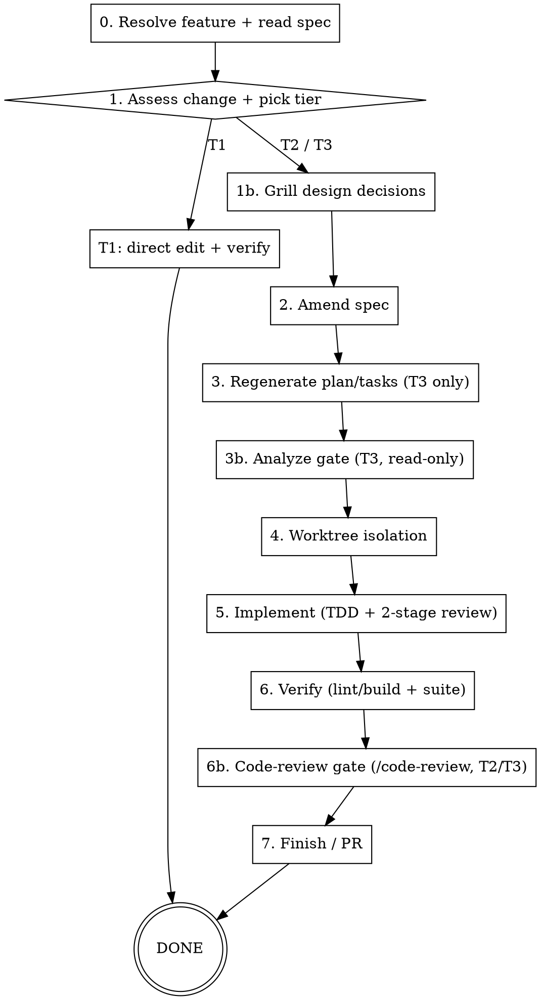

# Improve

End-to-end workflow for **changing an existing feature**. The feature already works as specified; you want to extend or modify it. This skill keeps the **spec as the source of truth** (don't edit code without updating the spec) and **scales the ceremony to the size of the change**.

> **Routing:** new feature → `/feature` · change an existing feature → `/improve` (this skill) · bug you hit while testing → `/troubleshoot`.

This skill reuses the same building blocks as `/feature`:
- Your **spec layer** for the planning artifacts (amend the spec, plan, tasks)
- **Superpowers** for execution (`brainstorming`, `test-driven-development`, `subagent-driven-development`, `using-git-worktrees`, `finishing-a-development-branch`)
- The same two-stage review (spec-compliance + code-quality) on every change

## Stack profile (READ FIRST)

Load the project's **stack profile** before anything: `docs/stack.md` (preferred) or `sdd-stack.md` at repo root. If neither exists, prompt the user to create one from the plugin's `templates/sdd-stack.template.md`, or auto-detect conservative defaults. Everywhere this skill says **[PROJECT CONTEXT]**, substitute a compact summary from the profile (stack, binding files, conventions, frozen patterns, verify commands). Everywhere it says **[VERIFY]**, substitute the profile's *Verify commands*. Never hardcode a framework or build command.

See the profile's **Spec / planning layer** — adapt spec/plan/tasks steps to whatever spec tooling the project uses (Spec-Kit, plain markdown, or none). With no spec tooling configured, **default to plain-markdown specs**: for T2/T3 create a minimal `spec.md` if one doesn't exist, then amend it (create-then-amend). Don't require Spec-Kit.

## Input

`$ARGUMENTS` should contain a **feature reference** and a **change description**. Accept loose forms:
- `"leads-list — add a quality filter to the list header"`
- `"checkout: also show the tax breakdown per line item"`
- just a change description (no feature) — then resolve/ask for the feature (step 0).

## When to Use

- The feature exists and works to spec; you want to **add to it or change its behavior**.

**Don't use when:**
- It's brand-new functionality with no existing spec → `/feature`.
- The feature is producing a **wrong value / broken interaction / error** (it does NOT work as specified) → `/troubleshoot`. The line: *improve = change correct behavior; troubleshoot = fix incorrect behavior.* If unsure, ask the user.
- The feature works **exactly as built** but that built behavior is itself a **known defect or security hole** — that is *incorrect behavior* → `/troubleshoot`, even though nothing in the spec is changing. "Works as built" ≠ "works as specified" when the build was wrong.

## Scaling Guidance — decide before running

Match the ceremony to the change. Assess from `$ARGUMENTS` + a quick look at the resolved feature's spec and code surface:

| Tier | Size | Approach |
|------|------|----------|
| **T1 — Trivial** | < 30 min, 1–2 files, no user-visible behavior change (copy tweak, prop rename, small style fix) | Direct edit + verify. Update the spec only if the change alters documented behavior. Offer to do it inline. |
| **T2 — Scoped change** | 30 min – 2 hrs, single concern, localized | **Superpowers-only lane:** brainstorm (if vague) → branch/worktree → TDD (red→green) → two-stage review → finish/PR. Amend `spec.md` if behavior materially changes; skip plan/tasks regeneration. |
| **T3 — Substantial / behavioral** | > 2 hrs, multi-component, changes documented behavior or data shape, or user-shipped | **Full spec-amendment cycle:** amend spec → regenerate affected plan/tasks → worktree → per-task TDD loop with reviews → finish/PR. |

State the chosen tier to the user before proceeding. If T1, propose the inline path and stop unless they want more ceremony.

## Run mode — autonomous by default

Same contract as **`/feature` → "Run mode"** (see that skill for the full description). **Autonomous is the default** for **T2/T3** (T1 is a single direct edit, so the question doesn't arise): front-load the interactive gates, print the Decision Manifest, then run to PR stopping only at the stop-class. **Switch to step-through** only when the user asks to slow down ("run slowly", "stop at each step", "walk me through it"). Under `/loop` / no live user, run unattended.

- **Front-loaded block (main session):** grill (1b, if used) → amend spec → clarify (`/speckit-clarify`, interactive). For `/improve` the upfront decisions are about the **delta** — which fields/components change, migration/access-control impact, edge cases against existing behavior.
- **Decision Manifest** before going heads-down: resolved delta decisions + the deferred-decision policy.
- **Autonomous chain (subagents):** plan/tasks (T3) → analyze (3b) → worktree → implement loop → reviews → verify → finish.

**STOP-class (never guess; halt and surface even mid-run)** — identical to `/feature`: **schema / DB migrations** · **security / auth / secrets** · **frozen-pattern changes** · **one-way doors** (any hard-to-reverse choice with medium/significant refactoring or long-term maintenance cost — architecture, public API/contract shape, data model, framework/dependency choice, irreversible data ops; when unsure, treat as one-way and stop). `/improve` touches **working** code, so add one more reflex: **a change that would break backward compatibility** for existing callers/data is a one-way door — stop. Everything else (coverage gaps fixable by amending an artifact, convention-default ambiguities, MEDIUM/LOW analyze findings) is auto-resolve-and-log.

## Process Overview



## Step-by-Step Instructions

### 0. Resolve the feature + read its spec

1. Parse `$ARGUMENTS` into `FEATURE_HINT` and `CHANGE_DESCRIPTION`.
2. **Resolve the feature directory** using the profile's **spec location glob**. Search:
   ```
   <spec glob from profile, e.g. specs/**/spec.md>  | grep -i "<slug fragment from FEATURE_HINT>"
   ```
   - Exactly one match → that's `FEATURE_DIRECTORY`. Read its `spec.md` (and `plan.md`/`tasks.md` if present) — your **current-behavior baseline**.
   - Multiple or zero matches → ask the user which feature, listing candidates.
   - **No spec exists for the area** → this is effectively new work on undocumented code. Tell the user and offer to route to `/feature` (which will create a spec).
   - **No spec layer at all** (profile says "none") → read the impacted code directly as the baseline, AND create a minimal plain-markdown `spec.md` capturing the current + intended behavior before amending, so there's a contract to amend going forward. (Spec-Kit is not required — plain markdown is fine; default location `docs/specs/<NNN>-<slug>/`.)
3. Read the profile's **binding context files** and note any **frozen patterns** in the impacted area — changing those needs explicit user authorization.
4. Identify the code surface from the spec's impacted-files list + the change description.

### 1. Assess the change + pick a tier

Apply **Scaling Guidance**. State the tier and your reasoning. Also state the **run mode**: for T2/T3, **autonomous by default** (front-load grill+clarify, print the Decision Manifest, then run to PR stopping only at the stop-class); switch to **step-through** only if the user asked to slow down.

- **T1** → go to the T1 path, then stop.
- **T2 / T3** → continue to step 2.

**Brainstorm gate (conditional):** if the change is vague or has multiple plausible interpretations, invoke **`superpowers:brainstorming`** first.

**Grill gate (recommended for T3, optional for T2):** before amending the spec, invoke **`grill-me`** to stress-test the change's design decisions one branch at a time — each question carrying your recommended answer, exploring the existing code/spec to answer where possible. Resolves the design tree of the *delta* (which fields/components change, access-control impact, migration concerns if data shape changes, edge cases against existing behavior). Skip for T1, for an unambiguous small T2, or in any non-interactive context — record open decisions as NEEDS_CLARIFICATION instead.

---

### T1 path — direct edit

1. Make the minimal edit on an `improve/<feature-slug>-<short-slug>` branch off `main` (not on `main`).
2. Run **[VERIFY]** — confirm clean (paste output).
3. If the change altered documented behavior, update the relevant line(s) in `spec.md` in the same commit.
4. Commit. Offer to open a PR via `superpowers:finishing-a-development-branch`.

Stop here for T1.

---

### 2. Amend the spec

The spec is the contract; change it **before** the code. For **T2/T3 this step always runs** — if no prior spec existed (the "none" / undocumented-code case from step 0), "amend" becomes **create-then-amend**: first write the minimal `spec.md` capturing current + intended behavior, then fold in the change. Only **T1** with genuinely no behavior change may skip it.

Dispatch a **spec-amendment subagent** (or amend inline for small changes):

```
You are amending an existing feature spec.

Feature directory: FEATURE_DIRECTORY
Change requested: CHANGE_DESCRIPTION

[PROJECT CONTEXT]
- Read the EXISTING FEATURE_DIRECTORY/spec.md first — preserve everything that isn't changing.

Amend the spec:
1. Integrate the requested change into spec.md — add/modify only the affected requirements, user stories, and acceptance criteria. Do NOT rewrite unchanged sections.
2. Mark any genuine new ambiguity as NEEDS_CLARIFICATION (the next step resolves it).
3. Keep a clear record of WHAT CHANGED (a short "Change log" note at the top of the amended section is fine).
4. Commit.

Return:
- SPEC_FILE: path
- CHANGED_SECTIONS: which requirements/stories were added or modified
- OPEN_CLARIFICATIONS: count of NEEDS_CLARIFICATION markers
- STATUS: DONE or BLOCKED with reason
```

If `OPEN_CLARIFICATIONS > 0` and non-trivial, run the clarify gate before planning — same as `/feature` step 2: **when Spec-Kit is the spec layer, `EXECUTE_SKILL: speckit-clarify`** (it scans the amended spec, asks up to 5 recommended-answer-first questions, and writes the answers back under a dated `## Clarifications` log); otherwise resolve ambiguities with a hand-rolled clarify pass or surface genuine product decisions to the user. Skip `/speckit-clarify` in non-interactive contexts (`/loop`).

---

### 3. Regenerate the affected plan + tasks — **T3 only**

For **T2**, skip this — go straight to step 4 and drive the change as a single TDD slice.

For **T3**, dispatch **plan** then **tasks** subagents, but **scoped to the delta** — do not re-plan unchanged parts:

```
You are updating the plan for a CHANGED feature.

Feature directory: FEATURE_DIRECTORY
Changed sections: CHANGED_SECTIONS (from step 2)

[PROJECT CONTEXT]
- Read the amended spec.md AND the existing plan.md.

Update plan.md focused on the delta:
1. Cover the changed/added requirements only — new components, modified data flow, migration concerns if data shape changed.
2. Preserve existing plan content for unchanged parts.
3. Ensure test tasks precede implementation tasks for the new work (TDD ordering).
4. Commit.

Return: PLAN_FILE, DELTA_COMPONENTS, TDD_TASKS_PRESENT (yes/no), STATUS.
```

```
You are generating tasks for the CHANGE to a feature.

Feature directory: FEATURE_DIRECTORY

[PROJECT CONTEXT]
- Read amended spec.md + updated plan.md. Generate tasks ONLY for the change (plus any regression-safety tasks). Do not re-list already-shipped tasks.
- TDD REQUIRED: each impl task preceded by its test task. Format: - [ ] TXXX [P] [USN] Description with file path

Commit.

Return: TASKS_FILE, TASK_COUNT, TEST_TASK_COUNT (must be > 0), TASKS_SUMMARY, STATUS.
```

If `TEST_TASK_COUNT` is 0, re-dispatch with explicit TDD instruction.

---

### 3b. Analyze — cross-artifact consistency gate (T3 only, read-only)

For **T3**, after the plan/tasks are regenerated, verify the amended `spec.md`, `plan.md`, and `tasks.md` still agree **before** the worktree — same gate as `/feature` step 4b. Because `/improve` edits *working* code, the highest-value check here is that the **delta** is fully covered: every changed/added requirement has a task, no task references a requirement the amendment removed, and terminology stayed consistent with the parts of the spec you did NOT touch.

**READ-ONLY — never edits files.**

- **Spec-Kit present** → `EXECUTE_SKILL: speckit-analyze` (loads spec/plan/tasks + constitution; emits a severity-ranked findings table + coverage %).
- **Plain-markdown / none** → dispatch the lightweight read-only analyze subagent from `/feature` §4b, but tell it to focus on the **changed sections** (`CHANGED_SECTIONS` from step 2) and on regressions against unchanged requirements.

Act on the result as in `/feature` §4b: **CRITICAL/HIGH** → fix the offending artifact (amend spec + re-clarify, or re-dispatch the scoped plan/tasks) and re-run until CLEAN; **MEDIUM/LOW** → proceed and flag for the reviewers. **T2 skips this gate** (single-slice change, no regenerated plan/tasks to drift).

---

### 4. Worktree isolation

Invoke **`superpowers:using-git-worktrees`** to set up an isolated workspace on an `improve/<feature-slug>-<short-slug>` branch off `main`, with a green baseline (**[VERIFY]**). Record the **absolute** `WORKTREE_PATH`. For **T2** a worktree is optional; **T3** assumes isolation.

**Worktree dispatch contract (when a worktree is in use):** subagents start in the repo root, not the worktree — so every code/review subagent you dispatch (including the two reviewers reused from `/feature`) MUST carry the absolute `WORKTREE_PATH` at the top of its prompt and make `cd "WORKTREE_PATH" && git rev-parse --show-toplevel` (output must equal `WORKTREE_PATH`, else STOP and return BLOCKED) its first action. Run all file ops and git commands from inside the worktree. **An empty `git diff main...HEAD` is a wrong-tree symptom, not clean code — never report COMPLIANT/APPROVED/"no changes" off it.** See `/feature` §5 for the full contract and red-flags list — the prompt templates there already bake it in. Skipping this makes reviewers diff a clean branch and falsely report "no changes". If building without a worktree (small T2), this contract doesn't apply.

---

### 5. Implement — TDD + two-stage review

**T2 (single slice):** invoke **`superpowers:test-driven-development`** directly — write the regression/feature test (red), implement minimal code (green), refactor. Then run **both** reviews below once across the diff.

**T3 (task loop):** use **`superpowers:subagent-driven-development`** — one fresh subagent per task (the task list is the contract; implementers execute, they do **not** re-plan), with TDD inside each task. Do **not** also invoke a separate spec-tooling "implement" command.

> **UI rule (use the design agents for UI work).** When the change builds or substantially restyles a **user-facing surface** (screen/component/page/layout — not pure logic, data, server, or tests), invoke the **`frontend-design`** skill and apply a UX-design review instead of hand-writing first-draft markup — the same design-agent approach `/feature` §6 uses. Stay **inside the frozen design system**: preserve the project's theme tokens/palette ([PROJECT CONTEXT]); enhance layout/UX, don't redesign the palette. Non-UI changes skip it.

After each slice/task, run the two reviewers from `/feature` (reuse those exact prompts):

- **Spec-compliance review** — does the diff implement what the amended spec requires for this change, nothing missing, nothing over-built? Loop until compliant.
- **Code-quality review** — conventions from [PROJECT CONTEXT] (styling, file-size limit, auth pattern, cache/query invalidation, data-access layer), no logged secrets, no leftover debug logging, error states handled, no lint/type errors, and **no unauthorized change to a frozen pattern**. Fix critical/important issues, then re-review.

**Regression guard (important for /improve):** because you're touching working code, explicitly run the **pre-existing test suite** (per the profile's verify commands) after the change, not just the new tests — confirm you didn't break the parts of the feature you weren't changing.

---

### 6. Verify

Run directly, confirm output (`superpowers:verification-before-completion`) — **from inside `WORKTREE_PATH`** when a worktree is in use (`cd` there first; the changed code lives in the worktree, not the repo root):

1. New tests pass.
2. **[VERIFY]** — zero errors. Paste relevant output.
3. **Full pre-existing suite still green** — no regressions in unchanged behavior.
4. **Code-review gate (`/code-review`) — correctness + cleanup sweep on the change.** The two-stage review in §5 is **spec- and convention-aware** (does the diff implement the amended spec; are conventions/frozen patterns respected). `/code-review` is the complementary **bug-hunting + cleanup** pass over the change's diff — correctness bugs and reuse/simplification/efficiency cleanups the spec-focused reviews don't target. Because `/improve` touches **working** code, this is also a regression sweep: it reads the diff for bugs the change may have introduced. Run it for **T2/T3** (T1's single direct edit doesn't warrant it), **from inside `WORKTREE_PATH`** when a worktree is in use (`cd` there first), at effort scaled to the tier — **`medium`** for T2, **`high`** for T3:

   ```
   /code-review medium   # T2 — or: /code-review high for T3
   ```

   Handling: **correctness bugs at critical/important severity are blockers** → fix before the PR (TDD slice or fix subagent for T3, or `/code-review … --fix` when small), then re-run **[VERIFY]** + the pre-existing suite and re-review until clean. **Cleanups** → apply the safe, localized ones (`--fix`), re-verify; defer scope-expanding or uncertain ones to PR notes. **Never auto-apply a fix that crosses the stop-class** (schema/migration, security/auth/secrets, frozen pattern, one-way door, or a backward-incompatible change) — surface it instead. **Non-interactive** (`/loop`): the review still runs; apply only clearly-safe fixes, queue stop-class blockers as PR notes.
5. **E2E browser smoke gate (soft).** For T2/T3, if the profile's e2e gate is `enabled: true`, invoke the **`e2e-smoke`** skill with `FEATURE_DIRECTORY`, `WORKTREE_PATH`, and `SMOKE_FOCUS` = the behavior delta. Soft-gate contract: `PASS` → §7. `FAIL` → fix (back to §5), re-run. `BLOCKED` → surface the reason and ask whether to proceed without the e2e check. Run e2e **after** the code-review gate so it validates the post-cleanup state. T1 (no behavior change) skips it; disabled gate skips it.

If any check fails, return to step 5 — don't proceed to PR with a failing gate.

### 7. Finish / PR

Invoke **`superpowers:finishing-a-development-branch`**. PR body:

- **Feature changed:** the feature's `spec.md` (link) + which sections were amended.
- **What changed & why:** the behavior delta.
- **Tests:** new tests added + confirmation the existing suite still passes.
- **Verification:** verify commands clean.
- **Smoke-test checklist:** steps for the user to verify the change in the UI.
- **Visual evidence (whenever the e2e gate ran):** embed the `e2e-smoke` per-step **screenshots** + the **Playwright video/report link** (the CI artifact URL from the `e2e` job, or a preserved local capture under `e2e-evidence/`) — show the changed UI working, don't just describe it.

Report the PR URL.

---

## Skill Coordination

| Phase | Skill | Role |
|-------|-------|------|
| Resolve feature | (inline `find`/`grep` via profile's spec glob) | Locate the existing spec — the behavior baseline |
| Clarify the change | `superpowers:brainstorming` | Pin down vague change requests before amending |
| Grill the design | `grill-me` | Resolve the change's design tree (T3 recommended) before amending |
| Amend spec | spec layer (amend) + clarify (`/speckit-clarify` if Spec-Kit) | Update the contract first |
| Plan/tasks (T3) | spec layer plan/tasks | Scoped to the delta only |
| Analyze (T3) | `/speckit-analyze` or read-only subagent | Cross-artifact consistency on the delta before code (§3b) |
| Isolation | `superpowers:using-git-worktrees` | Don't disturb the working tree |
| Build | `superpowers:test-driven-development` / `superpowers:subagent-driven-development` | TDD; per-task loop for T3 |
| Review | (the two reviewer prompts from `/feature`) | Spec-compliance + code-quality on every change |
| Code review (T2/T3) | `/code-review` | Correctness-bug + cleanup sweep over the change's diff (§6.4) — complements the spec/convention review |
| Verify | `superpowers:verification-before-completion` | Gates + regression suite before claiming done |
| Ship | `superpowers:finishing-a-development-branch` | Branch → PR + worktree cleanup |

## Error Recovery

| Situation | Action |
|-----------|--------|
| No stack profile found | Prompt user to create `docs/stack.md`, or auto-detect defaults |
| Change description vague | `superpowers:brainstorming` before amending the spec |
| Change design decisions unresolved (T2/T3) | Run `grill-me` (step 1b) before amending |
| Grill gate but no live user | Skip grill; record open decisions as NEEDS_CLARIFICATION |
| No spec for the area | Tell the user; offer `/feature` (creates a spec) |
| Multiple feature matches | List candidates, ask which |
| Reported behavior is actually a bug | Route to `/troubleshoot` (improve = change correct behavior) |
| Change needs a schema change | Stop — schema changes need explicit user approval |
| Change touches a frozen pattern | Surface to user — needs explicit authorization |
| Analyze gate (T3) finds CRITICAL/HIGH on the delta | Fix the artifact before the worktree (amend spec + re-clarify, or re-dispatch scoped plan/tasks); re-run until CLEAN (§3b) |
| Implementer tries to re-plan (T3) | Re-dispatch: "tasks.md is the contract — execute, don't re-plan" |
| `/code-review` gate (§6.4) finds a correctness/regression blocker | Fix it (TDD slice or fix subagent, or `--fix` if small) before the PR; re-run [VERIFY] + the existing suite and re-review until clean |
| `/code-review` finding's fix would cross the stop-class (incl. backward-incompatible) | Don't auto-apply (no `--fix`); surface it and follow the deferred-decision policy |
| Subagent worked in the repo root (reviewer reports "no changes"; commits missing from the branch) | Re-dispatch with the absolute `WORKTREE_PATH` block at the top and the `cd … && git rev-parse --show-toplevel` self-check first (see `/feature` §5 dispatch contract) |
| Existing suite breaks after change | Treat as a regression — fix before PR |

## Done When

- [ ] Stack profile loaded; stack specifics came from it
- [ ] Tier assessed and stated; ceremony matched the change
- [ ] Run mode stated (autonomous by default for T2/T3; step-through only if asked); grill+clarify were front-loaded and a Decision Manifest shown, and no stop-class decision (schema/migration, security/auth/secrets, frozen pattern, one-way door, or a backward-incompatible change) was made without surfacing it
- [ ] Existing feature + spec resolved (or routed to `/feature`)
- [ ] A `spec.md` exists and was amended before code for T2/T3 (created-then-amended if none existed); only pure T1 with no behavior change may skip
- [ ] For T3: analyze gate (§3b) ran after plan/tasks regen and returned CLEAN (delta fully covered, no contradictions) before the worktree
- [ ] New tests written first (red → green); change implemented to spec
- [ ] Two-stage review passed (spec-compliance + code-quality)
- [ ] Code-review gate (`/code-review`, §6.4) ran for T2/T3 over the change's diff; correctness/regression blockers fixed and re-verified, safe cleanups applied (or deferred to PR notes), no stop-class change auto-applied
- [ ] Verify commands clean; **full existing suite still green**
- [ ] E2E smoke gate (if enabled) ran for T2/T3: `PASS` (or `BLOCKED` with explicit user go-ahead)
- [ ] Branch → PR with amended-spec link + smoke-test checklist
- [ ] PR URL reported to the user
