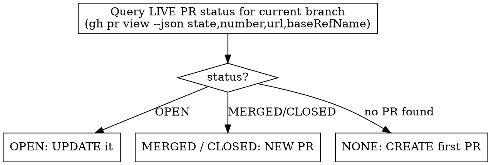

# pr

Get the current branch's work onto the right pull request — synced with the base, verified, and pushed — without you having to spell out the steps each time.

## Overview

**Core principle: the branch decides the PR, and the *live* PR status decides update-vs-new. Never trust session memory about a PR — re-check it every run.**

The recurring failure this prevents: an agent assumes "the PR from earlier this session" is still the active one and pushes follow-up work to it. But that PR may already be **merged** (follow-up work then needs a *new* PR), and the branch is usually **behind main** (the push needs a rebase first). `/pr` always queries the live PR status for the current branch, rebases onto the base, and routes accordingly.

## The contract (non-negotiable)

**`/pr` leaves the PR rebased-on-base, verified, and pushed — or it pushes nothing.** A bare push that leaves the PR behind base or conflicting is the *exact* problem this skill exists to end. So:

- **Always rebase onto the base before pushing.** "Just push, deal with main later" / "I'm in a hurry, skip the rebase" / "CI will catch it" is **not** `/pr`. Leaving the PR conflicting is the failure, not a shortcut.
- **Always run [VERIFY] before the push, and never push on red.** A fast push of a broken branch is still broken.
- **Violating the letter here is violating the spirit.** The whole point is to stop you from having to repeat "rebase from main and verify" every time — an agent that skips it because *this once* feels urgent has reintroduced the problem.

If someone explicitly asks you to push **without** syncing/verifying, that's outside this skill — **stop and say so**, and confirm they want a raw `git push` instead of `/pr`. Don't silently downgrade `/pr` into a bare push.

## When to Use

- You made a follow-up change and want it on a PR.
- Main moved on and your open PR needs to be brought up to date.
- Your PR shows conflicts with its base.
- The earlier PR for this branch got merged and you have more changes.
- You have several PRs in one session and want this branch's PR handled — not another.

**Don't use for:** the very first finish of a fresh feature when you'd rather run the full `superpowers:finishing-a-development-branch` flow (changelog/cleanup prompts). `/pr` is the lightweight update/follow-up path; it will still *create* a PR if the branch has none.

## The one decision that matters



Branching on **stale assumptions instead of the live query** is the bug. Run the query first, every time.

## Procedure

### 0. Capture the follow-up, then read the ground truth

1. `BRANCH=$(git branch --show-current)`.
2. `BASE` = the repo's default branch: `git remote show origin | sed -n 's/.*HEAD branch: //p'` (fallback `main`). Most repos: `main`.
3. **Don't lose uncommitted work.** If `git status --porcelain` is non-empty, commit it to `BRANCH` now (a normal scoped commit) — a rebase needs a clean tree. (Stash only if you're unsure where it belongs.)
4. `git fetch origin`.
5. **Query the live PR — do not rely on memory:**
   ```
   gh pr view "$BRANCH" --json state,number,url,baseRefName
   ```
   Non-zero / "no pull requests found" ⇒ status is **NONE**.

### 1. Route on the live status

**OPEN → update this PR (the common case):**
1. **Rebase onto the base** (your house style is rebase, not merge):
   `git rebase "origin/$BASE"`
2. **Conflicts?** Resolve them preserving *this branch's intent* (the change is the point; the base is context). Then `git add <files>` and `git rebase --continue`. Repeat until the rebase finishes.
3. **Verify:** run the project's **[VERIFY]** command. It must exit clean.
   - Green → step 4.
   - Red → **STOP. Do not push.** Surface what failed (a bad conflict resolution is the usual cause).
4. **Push the new revision:** `git push --force-with-lease` (rebase rewrote history; `--force-with-lease` is safe, plain `--force` is not). The open PR updates automatically.
5. Report: PR number + URL, that it's rebased on `BASE`, and verify is green.

**MERGED / CLOSED → open a NEW PR for the follow-up:**
The branch's PR is done; pushing more commits to it goes nowhere. Put the follow-up on a fresh branch **based on the updated base**, not on the stale branch:
1. New branch off the synced base: `git checkout -b "<type>/<slug>-followup" "origin/$BASE"` (`<type>` = feature/improve/fix per the change).
2. Bring the follow-up commits over: `git cherry-pick <the commits that aren't in BASE>` (or, if the follow-up was uncommitted, re-apply/commit it here).
3. **Verify** ([VERIFY], must be green — same STOP rule).
4. `git push -u origin HEAD`.
5. `gh pr create --base "$BASE" --head "$(git branch --show-current)" --title "…" --body "…"`.
6. Report the **new** PR number + URL, and that it supersedes the merged one.

**NONE → create this branch's first PR:**
1. Rebase onto base (steps as in OPEN, including conflict resolution).
2. **Verify** (green, else STOP).
3. `git push --force-with-lease` (or `-u origin HEAD` if never pushed).
4. `gh pr create --base "$BASE" --head "$BRANCH" --title "…" --body "…"`; report number + URL.

### Argument override
- `/pr new` ⇒ force the **NEW PR** path even if an open PR exists (you deliberately want to split this work out).
- A free-text arg ⇒ use it as the PR title/summary when creating.

## Quick reference

| Live PR status | Action | Push |
|----------------|--------|------|
| OPEN | rebase onto base → resolve → verify → push | `git push --force-with-lease` |
| MERGED / CLOSED | new branch off `origin/BASE` → cherry-pick follow-up → verify → push → `gh pr create` | `git push -u origin HEAD` |
| NONE | rebase → verify → push → `gh pr create` | `--force-with-lease` / `-u` |

Sync is always **rebase onto `origin/BASE`**. Push after a rebase is always **`--force-with-lease`**. Verify is always **before** the push, and a red verify always **stops** the push.

## Red flags — STOP and recheck

- You're about to push to a PR **without** having run `gh pr view` this run — you're trusting memory. Query first.
- You reached for **`git merge origin/main`** or a merge commit — house style is **rebase**. Use `git rebase "origin/$BASE"`.
- You're about to **push the branch as-is while it's behind base** ("to start CI", "deal with main later") — that leaves the PR conflicting, which is the failure `/pr` prevents. Rebase first.
- You're skipping **[VERIFY]** because you're rushed — verify before the push, always.
- You're force-pushing with plain **`git push --force`** — use **`--force-with-lease`**.
- The PR came back **MERGED/CLOSED** and you're still pushing to that branch — its review is over; open a **new** PR off updated base.
- You're creating a follow-up PR by branching off the **stale** feature branch instead of `origin/BASE` — it'll be born behind/conflicting. Branch off the synced base.
- **[VERIFY] failed and you pushed anyway** — never. A failing verify after a conflict resolution means the resolution is wrong.

## Common mistakes

| Mistake | Reality |
|---------|---------|
| "The PR from this session is still open, just push" | It may be merged. One `gh pr view` is cheap; a wrong push is not. Check every run. |
| "Merge is safer than rebase on a shared branch" | This workflow's house style is rebase + `--force-with-lease`. Don't switch to merge to dodge the force-push. |
| "I'm in a hurry — skip the rebase, just push, deal with main later" | Leaving the PR behind/conflicting is the exact problem `/pr` ends. The rebase IS the task, not ceremony. If you truly want a raw push, that's not `/pr` — say so and confirm. |
| "Push now so CI starts, rebase after" | CI on a behind/conflicting branch tests the wrong tree. Rebase + verify first, then one clean push. |
| "Conflicts resolved, ship it" | Run [VERIFY] first. A clean rebase with a broken build is still broken. |
| "PR was merged, I'll branch off the old branch for the follow-up" | That branch is behind base. Branch off `origin/BASE` so the new PR is current. |
| "force-push to update the rebased branch" | `--force-with-lease`, not `--force` — it refuses to clobber commits you haven't seen. |
