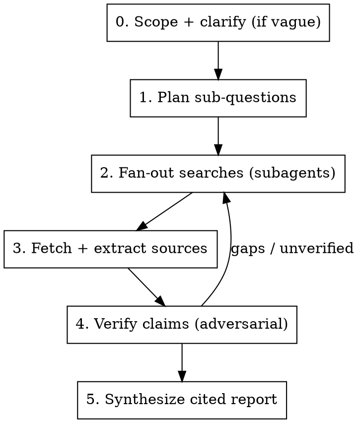

# Research

Multi-source web research that produces a **cited, verified report** — not a single search and a vibe. The shape mirrors a deep-research agent: a **lead** decomposes the question and plans, **subagents** fan out to investigate sub-questions in parallel, every claim is **traced to a fetched source**, and a final **synthesis** stitches the findings into one answer with inline citations and a sources list.

> **Routing:** evidence-backed answer to a *question or topic* → `/research` (this skill) · build/change/fix *code* → `/feature` · `/improve` · `/troubleshoot`. If the user wants you to investigate the **codebase** rather than the web, just explore the repo directly — this skill is for web research.

Flow: scope → plan sub-questions → fan-out searches (subagents) → fetch & extract → verify claims → synthesize cited report.

## When to Use

- User asks a question whose good answer spans **multiple sources** (state of the art, comparisons, "what's true about X", market/landscape scans, due diligence).
- User explicitly says "research", "deep dive", "gather sources", "look into".
- An answer you'd otherwise give from memory would be **stronger with current, citable evidence** — offer to research it.

**Don't use when:**
- The answer is a single lookup (one fact, one doc page) — just `WebSearch`/`WebFetch` once and answer. Say it's too small to warrant the full pass.
- The question is about **this repository or local files** — explore directly.
- The user wants code built/changed/fixed — route to `/feature` · `/improve` · `/troubleshoot`.

## Scaling Guidance — decide before running

Match the ceremony to the question. Assess from `$ARGUMENTS`:

| Size | Approach |
|------|----------|
| **Single fact / one source** | Skip the pipeline. One or two searches inline, answer with the link. Tell the user it didn't need the full pass. |
| **Focused question, 2–4 sub-questions** | Lightweight: do the searches yourself (no subagents), fetch the top sources, verify, write a short cited answer. |
| **Broad / contested / high-stakes topic** | **Full pipeline** (this skill, all steps) with parallel subagents and the verification gate. |

If the work is clearly in the top tier, say so and propose the lighter path rather than spinning up subagents.

## Clarify first (if the scope is ambiguous)

Before researching, make sure the question is answerable. If it's underspecified in a way that changes *what* you'd look for (e.g. "what car should I buy" with no budget/use-case/region), ask **2–3 sharp clarifying questions** via `AskUserQuestion`, then weave the answers into the scope. Don't ask when the question is already specific — just research it.

## Process Overview

## 1. Plan sub-questions

Decompose the topic into **3–6 independent sub-questions** that, answered together, cover it. Write them down (a short todo list the user can see). Good sub-questions are orthogonal — minimal overlap, each worth a dedicated search thread. State any assumptions and the time horizon (e.g. "current as of 2026").

## 2. Fan-out searches (subagents)

For the full pipeline, dispatch **one subagent per sub-question** with the `Agent` tool, **in parallel** (multiple tool calls in one message). Give each subagent:

- The single sub-question and why it matters.
- Instructions to follow `references/search-tactics.md` for query craft (load it once at the start).
- A required return shape: **3–6 findings, each one sentence + the source URL + a one-line note on source quality**, plus any contradictions it hit. No prose essays — findings and links.

If you're running the lightweight tier, do the search threads yourself sequentially instead of spawning subagents.

> Prefer the **Tavily MCP** search/extract tools if they're available in the session (better ranking + clean extraction for research); otherwise use the built-in `WebSearch` and `WebFetch`. Check with `ToolSearch` for `tavily` before assuming it's absent.

## 3. Fetch & extract sources

Don't trust search snippets — **fetch the actual page** for anything you'll cite (`WebFetch`, or Tavily extract). Pull the specific claim, the publication date, and who's behind it. Drop sources you can't open or that are pure SEO filler. Keep a running list of `{claim → URL → date → source-type}`.

## 4. Verify claims (adversarial)

This is the gate that separates research from a link dump. For every load-bearing claim:

- **Corroborate** important facts with a **second independent source** — not a mirror/republish of the first.
- **Actively look for the counter-case**: search for "X criticism", "X debunked", disconfirming data. Note disagreement instead of hiding it.
- **Date-check**: prefer current sources; flag anything stale or superseded.
- **Rank source quality**: primary/official > reputable secondary > forum/blog > anonymous. See `references/search-tactics.md` for the heuristics.

If important sub-questions came back thin, contradictory, or unverified, **loop back to step 2** with sharper queries before writing.

## 5. Synthesize cited report

Write **one coherent answer** to the original question — not a per-subagent dump. Lead with the answer, then support it. Default structure:

- **Bottom line** — the direct answer / key takeaways up front (2–5 bullets).
- **Findings** — organized by theme or sub-question, each material claim carrying an **inline citation** `[n]` to a fetched source.
- **Caveats / open questions** — contradictions, uncertainty, what's still unknown, confidence level.
- **Sources** — numbered list of `[n] Title — URL (publisher, date)`, only sources you actually fetched.

Rules: **every non-obvious claim is cited.** Distinguish *well-supported* from *single-source* from *speculation* — never launder a guess as a fact. State the freshness ("current as of <date>") and call out where evidence was weak.

## References

- `references/search-tactics.md` — how to craft and iterate search queries, and judge source quality (load before searching; pass to subagents).
