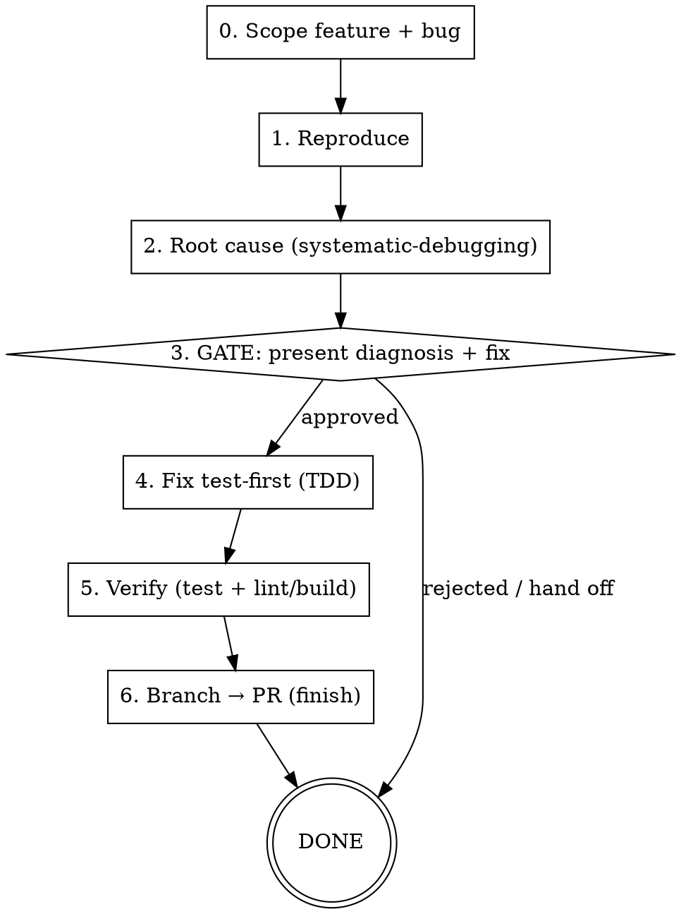

# Troubleshoot

End-to-end bug workflow for issues **you found while manually testing the app** in a feature built by agents. You are the tester; this skill diagnoses and fixes what you report. Combines:

- **`superpowers:systematic-debugging`** — the root-cause method (no fixes before root cause)
- The project's **backend-log tool** (from the stack profile, optional) for runtime/invocation bugs
- **`superpowers:test-driven-development`** — fix is written test-first (red → green)
- **`superpowers:finishing-a-development-branch`** — ship the fix as a branch → PR

**Autonomy contract:** the agent diagnoses **autonomously** to root cause, then **GATES** — it presents the diagnosis + proposed fix and waits for your approval **before changing any code**. After approval it implements, verifies, and ships without further prompting.

## Stack profile (READ FIRST)

Load the project's **stack profile**: `.sdd/stack.md` (preferred) or `sdd-stack.md` at repo root. If neither exists, prompt the user to create one from the plugin's `templates/sdd-stack.template.md`, or auto-detect conservative defaults. Everywhere this skill says **[PROJECT CONTEXT]**, substitute a compact summary from the profile. Everywhere it says **[VERIFY]**, substitute the profile's *Verify commands*. The profile's **Backend-log tool** and **Spec location glob** drive the optional branches below.

## Input

`$ARGUMENTS` should contain a **feature reference** and a **bug description**. Accept loose forms:
- `"leads-list — duplicate leads appear after sync"`
- `"checkout: estimate total shows $0 when line items exist"`
- just a bug description (no feature) — then infer/ask for the feature.

## When to Use

- You manually tested a feature and hit a bug, wrong value, broken interaction, or console error.
- The feature was recently built/changed by an agent and you want it diagnosed and fixed properly.
- A feature that "works" but is **wrong or unsafe by design** — a known tech-debt defect (e.g. a hardcoded auth bypass) — counts as *incorrect behavior* and belongs here, even though it works exactly as built and no spec is changing. ("Change how Y does X" on *correct* behavior is `/improve`; replacing *known-bad* behavior is `/troubleshoot`.)

**Don't use when:**
- It's a new feature request (use `/feature`).
- It's a change/extension to a feature that works as specified (use `/improve`).
- The "bug" is actually a spec change — fix the spec via `/spec`, then `/feature` (or `/improve` when amending).

**Not an exit:** "the user said it's obviously a one-liner" is a *hypothesis*, not a reason to skip. A reported wrong value in an agent-built feature is exactly this skill's job — investigate to root cause and gate the fix regardless of how trivial it looks. Only skip for a typo *you can see is a typo* in a file you're already editing for another reason.

## Process Overview



## Step-by-Step Instructions

### 0. Scope the feature + bug

1. Parse `$ARGUMENTS` into `FEATURE_HINT` and `BUG_DESCRIPTION`.
2. **Resolve the feature directory** using the profile's **spec location glob**:
   ```
   <spec glob from profile>  | grep -i "<slug fragment from FEATURE_HINT>"
   ```
   - Exactly one match → that's `FEATURE_DIRECTORY`. Read its `spec.md` (and `plan.md` if present) to understand intended behavior — your **expected-behavior oracle**.
   - Multiple or zero matches → ask the user which feature.
   - No spec (or no spec layer) → proceed without one, but note the diagnosis can't be checked against a spec.
3. Read the profile's **binding context files** — the bug may be a violation of a frozen pattern or a convention.
4. Identify the likely code surface from the spec's impacted-files list + the bug description.

### 1. Reproduce — establish the failing baseline

Invoke **`superpowers:systematic-debugging`** and follow its Phase 1 discipline:

1. Read any error messages / stack traces in the bug description **completely**.
2. Determine reproduction:
   - **UI bug:** identify the route/component and the exact interaction. If reproduction needs the running app, use the **`run`** skill (or `superpowers-chrome:browsing`) to drive it and observe.
   - **Backend/runtime bug:** use the profile's **backend-log tool** to pull logs for the failing invocation (e.g. a `base44:base44-troubleshooter` skill, `supabase functions logs`, `vercel logs`, `heroku logs`). If the profile says "none", inspect logs manually. **Never log or echo secret values — refer to them by name only.**
   - **Build/lint bug:** reproduce with the profile's **[VERIFY]** commands.
3. Confirm you can reproduce **consistently** before going further. If you cannot reproduce, say so and ask the user for exact steps / a screenshot / the failing value — do not guess.

### 2. Root cause investigation

Stay inside `superpowers:systematic-debugging` — **the Iron Law applies: NO FIXES WITHOUT ROOT CAUSE FIRST.**

- Use structured hypothesis testing (analyze → investigate → debug) across the candidate surface. (If a dedicated diagnostic skill like `/sc:troubleshoot` is installed, use it; otherwise do this inline.)
- Trace from symptom to mechanism: read the actual implicated code, the data schema if data shape is involved, and the spec's expected behavior.
- Form a hypothesis, find the evidence that confirms it (the specific line/condition/data), and rule out alternatives. A root cause names *the mechanism*, not just the symptom.
- Check the **stack-specific root-cause classes** the profile's conventions imply (e.g. silently-dropped unknown fields, missing cache/query invalidation, wrong auth accessor, data-mapping drift, concurrent-write races, styling violations).

### 3. GATE — present diagnosis + proposed fix (STOP here)

**Do not change any code yet.** Present to the user:

```
## Diagnosis
- Feature: FEATURE_DIRECTORY (or "no spec — area: …")
- Symptom: <what you reproduced, observed vs expected value/behavior>
- Reproduction: <exact steps / command>
- Root cause: <the mechanism — file:line, the specific condition/data>
- Evidence: <what proves it — log line, failing assertion, schema mismatch, the diff that introduced it>

## Proposed fix
- Change: <what you will change, where>
- Why this is the root-cause fix (not a symptom patch): <reasoning>
- Regression test: <the test you'll write first and what it asserts>
- Risk / blast radius: <other code paths touched, any frozen-pattern concerns>
- Spec impact: <none | spec is wrong and should be updated first>
```

Then wait. Proceed to step 4 **only on explicit approval**. If the user rejects or wants to adjust, revise or stop. If `Spec impact` says the spec is wrong, fix `spec.md` first.

**Incident carve-out (live bleed in progress):** the gate blocks **code changes**, not incident response. If damage is ongoing (e.g. a destructive job is still deleting records), **non-code mitigations are always allowed immediately and don't wait for the gate** — pause the cron/trigger or disable the job in the platform UI, flip a feature flag off, or roll back the last deploy. These stop the bleed in seconds without shipping unreviewed code. Recommend the mitigation **now**; the **code fix itself still goes through diagnosis → approval**. Don't let "every minute counts" collapse "stop the bleed" into "merge the patch" — they're separate actions.

### 4. Implement the fix — test-first (TDD)

After approval, invoke **`superpowers:test-driven-development`**:

1. **Branch:** create/switch to a `fix/<feature-slug>-<short-bug-slug>` branch off `main` (not on `main`).
2. **Red:** write a regression test that reproduces the bug — assert the *correct* behavior. Run it, confirm it **FAILS** for the root-cause reason (not a setup error).
3. **Green:** implement the minimal fix until the test passes. Fix the root cause, not the symptom. Stay within the profile's conventions and do not touch frozen patterns without saying so.
4. **Refactor:** clean up if needed, keeping the test green.
5. Commit the test + fix together.

### 5. Verify

Run directly, confirm output, **evidence before assertions** (`superpowers:verification-before-completion`):

1. The new regression test passes.
2. **[VERIFY]** — zero errors. Paste the relevant output.
3. The pre-existing test suite still passes (no regressions).
4. **E2E browser smoke gate (soft) — post-fix confirmation.** For a UI-visible bug, if the profile's e2e gate is `enabled: true`, invoke the **`e2e-smoke`** skill with `FEATURE_DIRECTORY` (or the area), `WORKTREE_PATH`, and `SMOKE_FOCUS` = the exact interaction that was broken — confirm it now produces the correct behavior in the running app. Soft-gate contract: `PASS` → §6. `FAIL` → the fix didn't hold in the real UI; back to step 4. `BLOCKED` → surface the reason, ask whether to ship without the e2e confirmation. (Reproduction in step 1 still uses `run`/browser debugging; this is the verification leg only. Skip for non-UI bugs.)

If any check fails, return to step 4 — do not proceed to PR with a failing gate.

### 6. Ship — branch → PR

Invoke **`superpowers:finishing-a-development-branch`** to open the PR. PR body:

- **Bug:** the symptom and how to reproduce it.
- **Root cause:** the mechanism (file:line).
- **Fix:** what changed and why it's the root-cause fix.
- **Test:** the regression test added.
- **Verification:** verify commands clean; suite green.
- **Link:** the feature's `spec.md` if one exists.

Report the PR URL to the user.

## Skill Coordination

| Phase | Skill | Role |
|-------|-------|------|
| Reproduce + root cause | `superpowers:systematic-debugging` | Iron-law method; gates fixes behind investigation |
| Diagnostic tooling | `/sc:troubleshoot` (if installed) | Structured hypothesis testing across code/build/runtime |
| Backend logs | profile's backend-log tool (optional) | Logs for runtime/invocation bugs |
| Drive the app | `run` / `superpowers-chrome:browsing` | Reproduce UI bugs in the running app |
| Fix | `superpowers:test-driven-development` | Regression test first, root-cause fix |
| Verify | `superpowers:verification-before-completion` | Run gates, confirm output before claiming fixed |
| Ship | `superpowers:finishing-a-development-branch` | Branch → PR + cleanup |

## Error Recovery

| Situation | Action |
|-----------|--------|
| No stack profile found | Prompt user to create `.sdd/stack.md`, or auto-detect defaults |
| Can't reproduce | Stop. Ask user for exact steps / screenshot / failing value — never guess a fix |
| Multiple feature matches | List candidates, ask which feature |
| No spec for the area | Proceed without the oracle; note diagnosis is unverified against a spec |
| Root cause is a spec error | Fix `spec.md` first, surface it, then fix code |
| Root cause is a frozen pattern | Surface to user — changing it needs explicit authorization |
| Red test won't fail | The test doesn't capture the bug — revise reproduction before fixing |
| Fix needs a schema change | Stop — schema changes need explicit user approval |
| User rejects the proposed fix | Revise diagnosis or hand off; do not implement |

## Done When

- [ ] Stack profile loaded; backend-log/e2e branches followed the profile
- [ ] Bug reproduced consistently (or escalated for repro steps)
- [ ] Root cause identified with evidence — not a symptom patch
- [ ] Diagnosis + proposed fix approved by the user (the gate)
- [ ] Regression test written first, confirmed red, then green
- [ ] Verify commands clean; existing suite green
- [ ] For UI bugs: e2e smoke confirmed the fix (`PASS`, or `BLOCKED` with explicit go-ahead) — if the gate is enabled
- [ ] Branch → PR created with bug/root-cause/fix/test summary
- [ ] PR URL reported to the user
